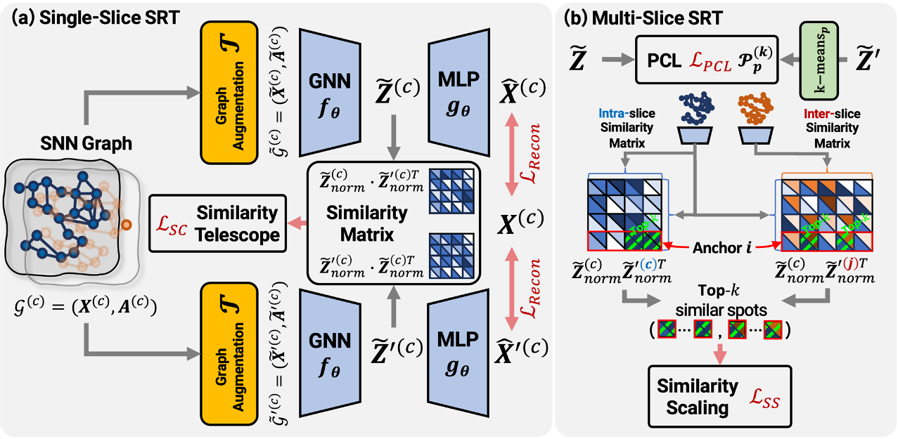

# Spotscape

<p align="center">   
    <a href="https://pytorch.org/" alt="PyTorch">
      </a>
    <a href="https://icml.cc/Conferences/2025" alt="Conference">
        </a>
    
</p>

The official source code for [Global Context-aware Representation Learning for Spatially Resolved Transcriptomics](https://openreview.net/forum?id=jeJGH6UDOL), accepted at ICML 2025.

## Overview

Spatially Resolved Transcriptomics (SRT) is a cutting-edge technique that captures the spatial context of cells within tissues, enabling the study of complex biological networks. Recent graph-based methods leverage both gene expression and spatial information to identify relevant spatial domains. However, these approaches fall short in obtaining meaningful spot representations, especially for spots near spatial domain boundaries, as they heavily emphasize adjacent spots that have minimal feature differences from an anchor node. To address this, we propose **Spotscape**, a novel framework that introduces the Similarity Telescope module to capture global relationships between multiple spots. Additionally, we propose a similarity scaling strategy to regulate the distances between intra- and inter-slice spots, facilitating effective multi-slice integration. Extensive experiments demonstrate the superiority of **Spotscape** in various downstream tasks, including single-slice and multi-slice scenarios.


<figure>
  <p style="text-align: center;">
  
  <figcaption>Figure 1. Overall framework of Spotscape, which is trained with the spatial nearest neighbor (SNN) graph, using (a) similary telescope and reconstruction loss, while additionally utilizing (b) PCL and similarity scale matching loss in multi-slice spatially resolved transcriptomics</figcaption>
  </p>
</figure>


## Environments

* ``python`` version: 3.9.7
* ``pytorch`` version: 2.1.1
* ``pyg`` version: 2.4.0
* ``pyg_lib`` version: 0.3.1
* ``faiss-cpu`` version: 1.7.4

```bash
# If your conda is not up-to-date (optional)
conda update -n base conda --yes
conda update --all --yes

# For environment setting
conda create --name spotscape python=3.9.7 --yes
conda activate spotscape
sh environment_setup.sh
```

## How to run the code?

Please find the example shell files as below.

```bash
# single-slice
sh run_single.sh

# multi-slice
sh run_multi_integration.sh
```

For the detailed descriptions of its arguments, please refer to the ``./utils/argument.py`` file.

## Cite

- If you use **Spotscape** in your research, please cite the following paper:
  - Yunhak Oh*, Junseok Lee*, Yeongmin Kim, Sangwoo Seo, Namkyeong Lee, and Chanyoung Park. "Global Context-aware Representation Learning for Spatially Resolved Transcriptomics." ICML 2025.

```bibtex
@inproceedings{
    oh2025global,
    title={Global Context-aware Representation Learning for Spatially Resolved Transcriptomics},
    author={Yunhak Oh and Junseok Lee and Yeongmin Kim and Sangwoo Seo and Namkyeong Lee and Chanyoung Park},
    booktitle={Forty-second International Conference on Machine Learning},
    year={2025},
    url={https://openreview.net/forum?id=jeJGH6UDOL}
}
```

